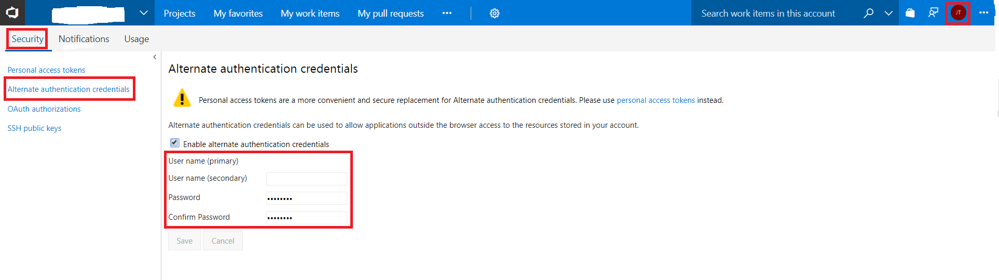

## What is VSTS Build And Release?

If you like VSTS and Chrome, this tool may help you. Its purpose is to quickly launch VSTS Builds and Releases directly from Chrome.

## Getting Started

Just install the Chrome extension and play with it. Alternate authentication credentials are needed to authenticate yourself in VSTS.
Here is how you can set it up.

